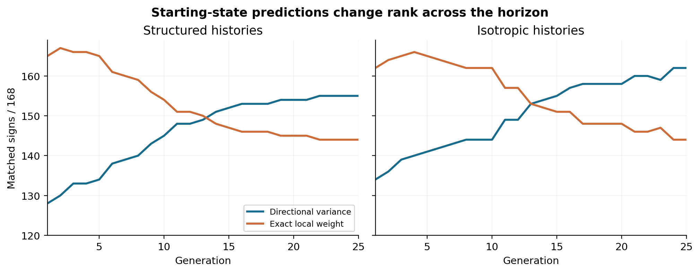
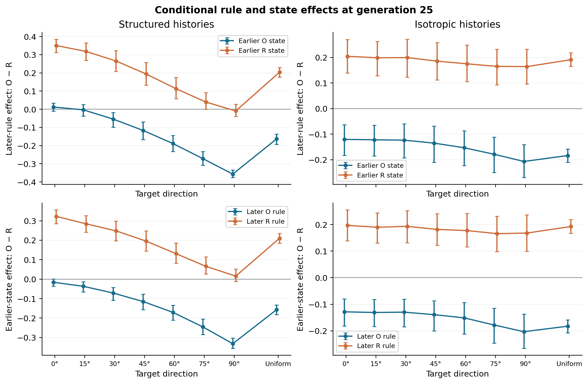
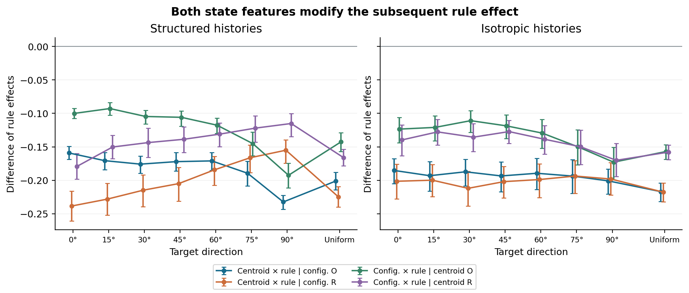
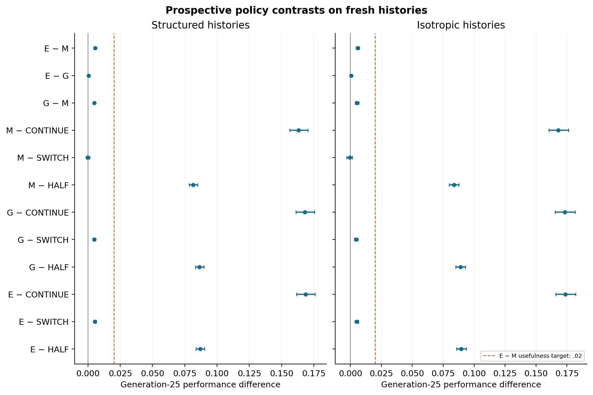
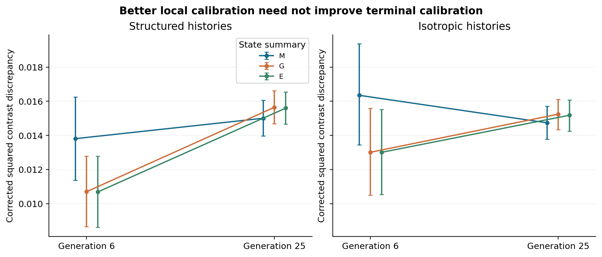
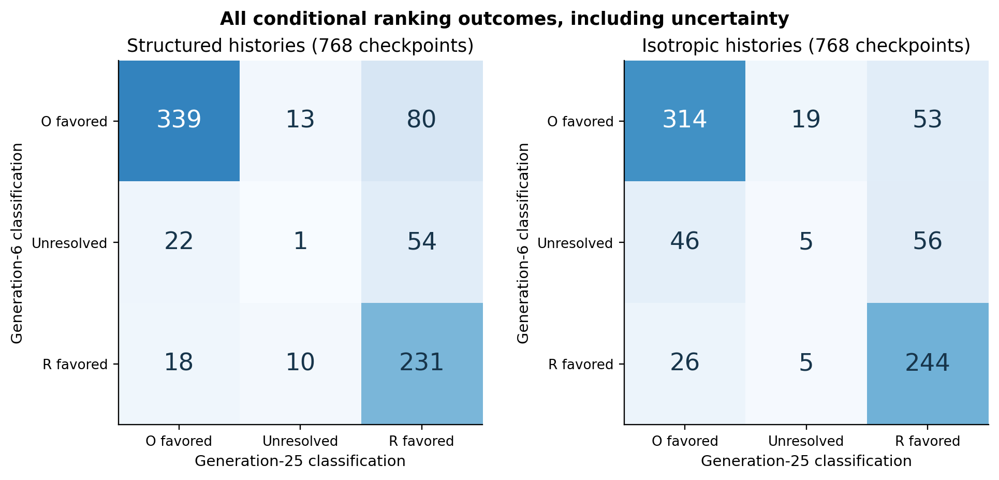

# Population state changes the transfer value of organized variation in a finite-population model

**Jack Chen**

Frederick Sequencing and Genomics Core; Advanced Biomedical Computational Science (ABCS); Frederick National Lab for Cancer Research; National Institutes of Health.

Research preprint, version 1.0, 22 September 2026. Computational study; not externally peer reviewed.

## Abstract

Historically acquired variation biases can facilitate adaptation, but their value may change as a population moves through a new environment. We studied a two-dimensional model comparing an inherited variation orientation with a quarter-turned control of identical covariance eigenvalues. Transfer comparisons showed conditional benefits and relative harms across target directions. An exact starting-state expectation of offspring weight predicted early population rankings well but underperformed a simpler directional predictor at generation 25. Crossed interventions then showed that the later rule effect depends on both the generation-5 centroid and the complete centered population configuration. On 48 freshly trained histories, fixed prospective choices using the empirical population improved generation-25 performance over centroid-only choices by 0.55–0.59 percentage points of initial normalized loss. Gaussian moments achieved most of this incremental gain. The improvement fell below the prespecified two-point target, unconditional switching was already strong, and subgroup harms remained. Independent continuations from fixed checkpoints then identified both local expected-contrast discrepancy and changes in conditional rule ranking between one step and the terminal horizon. More detailed local policies improved one-step effect-size calibration but worsened terminal calibration, despite fewer resolved terminal ranking contradictions. These results distinguish conditional state effects, prospective policy value, contrast calibration and ranking across horizons. Their scope remains the specified finite-population model; they identify neither a unique mediator nor a generally optimal adaptive policy.

## Introduction

Variation-generating structure can itself change during evolution. Network models have shown that changing environments can alter the production of beneficial variation, while developmental models have connected transfer to generalization from historical regularities. These precedents already establish that evolved organization can facilitate adaptation in specified settings. [1,2].

Environmental history can also shape covariance. do O and Whitlock investigated how correlated changes in selective optima influence the evolution of genetic covariance and subsequent adaptation. Their work supplies a relevant precedent for connecting history, covariance and performance; the empirical trait configurations in our simpler model are not a biological genetic covariance matrix. [3].

Our question concerns the transfer value of a given variation rule during a finite adaptation budget. An orientation favorable at the starting state need not retain the same value after selection changes the population. A statistic describing a single proposed offspring also need not rank the performance of a selected population several generations later. Distinguishing these quantities requires both trajectory measurements and interventions that change the population state independently of the rule applied to it.

We first compared inherited and rotated rules under three transfer settings. We then tested whether earlier population state changes the effect of a subsequent rule, and whether this dependence involves the population centroid, its complete centered configuration, or both. We then tested fixed choices using those state summaries on fresh histories, followed by independent continuations from a fixed subset of their checkpoints to separate local expected-contrast discrepancy from horizon-dependent ranking. The contribution assessed here is this sequence of conditional tests and prospective policy comparisons in a specified model, rather than a general claim that organized variation or adaptive search is newly demonstrated.

## Model and analysis

Each member of a population has two trait coordinates and a variation orientation. Historical training used 32 individuals for 120 generations. Targets were redrawn every five generations: the structured regime used the positive or negative horizontal direction, and the isotropic regime sampled directions uniformly. Offspring inherited a perturbed orientation and received Gaussian trait changes with principal standard deviations .12 and .02. Elitist selection retained 32 of 64 parent and offspring candidates using squared Euclidean loss to the current training target. A uniformly sampled final individual supplied the orientation for transfer.

The initial cohort contained 24 histories per regime. Transfer populations started at the same zero trait state. Rule O used the inherited orientation; rule R rotated it by 90 degrees while preserving mutation covariance eigenvalues. The seven fixed target directions were 0, 15, 30, 45, 60, 75 and 90 degrees, supplemented by a uniform-direction reference, with eight paired trials per history and family. Target angle is relative to the fixed historical axis, not necessarily the orientation drawn from a particular history. Matched random arrays paired the compared branches.

V1 used elitist transfer selection with squared Euclidean loss. V2 replaced transfer selection with sequential weighted sampling without replacement, with coefficient 10. V3 retained this sampling mechanism and used an anisotropic quadratic objective with H=R(30 degrees) diag(4,1) R(30 degrees)' and normalized loss L(x)=(x−t)'H(x−t)/(t'Ht). Population performance was 1 minus mean normalized loss, initially zero. The transfer endpoint was generation 25. Mutation resources were matched in Euclidean covariance eigenvalues; rotation does not generally preserve loss-weighted mutation effects. Numerical performance levels under different objectives are not directly interchangeable.

The intervention studies retained the V3 process and checkpoints. ORG-MECH-002 applied both later rules to each of the two generation-5 populations. ORG-STATE-003 additionally constructed populations by combining either checkpoint centroid with either complete centered configuration, then applied both rules. All ordered individual offsets were transferred. The manipulation therefore changed covariance and higher-order empirical structure together. Original same-donor coordinates were used directly to reproduce the four earlier control continuations.

Inference averaged eight trials within each history and target family before paired resampling of whole histories. The two intervention studies used 2,000 bootstrap resamples and linear-interpolated pointwise 95% percentile intervals, with separately fixed analysis seeds. Angles within a history and successive studies using the same history are dependent. The 48 original histories were reused through V1–V3 and the two state-intervention stages. The subsequent policy study used a new 48-history training cohort under the same algorithm. This provides fresh history draws for that prospective comparison, rather than independently repeating every previous intervention. Complete protocols, seeds, outcomes and analysis conventions are retained in their archived packages.

### Prospective choices on a fresh historical cohort

ORG-POLICY-004 retained the training process and V3 transfer model, with 24 new histories per regime. At each generation-5 checkpoint, three deterministic policies chose O or R for the remaining twenty generations. All checkpoint populations and 18,432 choices were stored and hash-frozen before any corresponding continuation was generated. The policy functions received current population/model information but no future draw, other early-arm population, regime label or later outcome.

Each policy used the same ideal normalized-weight selection functional with a different approximation to the parent/offspring distribution. M replaced all parents by a point at their centroid and modeled their offspring by one Gaussian. G modeled parents as a Gaussian with the observed mean and denominator-N covariance, adding mutation covariance for offspring. E retained every empirical parent point and its corresponding Gaussian offspring component. Parent and offspring components had equal total prior mass.

Write the normalized quadratic loss as L(x)=(x−t)'A(x−t), where A=H/(t'Ht), and beta=10. For a Gaussian component of mean m and covariance T, define r=m−t, B=A^{-1}+2 beta T, and

`log Z = −0.5 log(det(A) det(B)) − beta r' B^{-1} r`,

`q = tr(B^{-1} T) + (B^{-1}r)' A^{-1}(B^{-1}r)`.

Z is the expected unnormalized weight and q the mean loss after ideal normalized weighting. Mixture loss is the Z-weighted mean of component q values, evaluated with stable normalization. Each policy chose the rule with lower mixture loss, retaining its early rule for a difference within 1e-12. The functional is exact for the declared ideal mixture and approximates the finite sequential sampler; it does not directly predict the generation-25 population.

The primary comparison was E−M in generation-25 performance, separately by regime. Each history received equal weight after averaging all eight families, eight trials and both early arms. Comparators included always continuing, always switching, and the expected outcome of an independent 50/50 choice. The target of .02 performance units was fixed before new outcomes, representing two percentage points of initial normalized loss, without biological calibration. Paired 2,000-draw whole-history bootstrap arrays were frozen before training and reused across all policy-study summaries. All contrasts and subgroup intervals are exploratory and pointwise.

All policies had the same allowed observations and the same transfer candidate budget: 800 offspring and 1,600 selection scoring calls as implemented. The declared summaries limited what each policy consumed. Analytic work was reported separately: four Gaussian-component evaluations per checkpoint for M and G and 128 for E. No additional fitness probe or counterfactual rollout was available to a policy. These are calculations using the known quadratic model, not an equal-cost black-box optimizer benchmark.

### Independent-stream diagnosis of calibration and horizon change

ORG-DIAG-005 selected original trial IDs 0 and 1 from every family and history in the accepted policy study, retaining both early states. This fixed identifier-based panel contains 768 paired rows and 1,536 generation-5 checkpoint populations. Each paired row received 24 new independent evaluation replicates, with shared normal/uniform draws across its four branches within each replicate. The original coordinates, target literals, analytic predictions, policy choices and transfer process were unchanged. No policy choice used these new outcomes. These are new conditional transfer replicates from existing histories, not new training.

For checkpoint-specific frozen prediction a, define D_gj as the observed O-minus-R loss contrast in replicate j, equivalently R-minus-O performance. Positive D therefore favors R; this convention differs from the earlier displayed O-minus-R performance contrasts. At the fixed horizons g=6 and 25, let Dbar_g be the replicate mean and s_g² the sample variance with denominator R−1, where R=24. We estimate squared discrepancy from the conditional process mean by

`B_g = (a − Dbar_g)^2 − s_g²/R`.

Conditional on the checkpoint and prediction, E[B_g]=(a−E[D_g])² because the subtracted term removes the variance of the estimated mean. Independent replicates and finite second moments suffice. Negative finite-replication estimates are retained; flooring or square-rooting them would change the estimand or be undefined.

The horizon component is `H=(Dbar_25−Dbar_6)^2−s_(D25−D6)²/R`. With cross-horizon sample covariance s_6,25, the residual component is

`X = B_25−B_6−H = −2[(a−Dbar_6)(Dbar_25−Dbar_6)+(s_6,25−s_6²)/R]`.

The components obey an exact estimate identity but are not disjoint causal shares. Their expectations concern local calibration error, squared change in conditional mean contrast and a signed cross term, respectively.

The ideal mixture weights components by expected unnormalized survival weight. Actual sequential sampling without replacement instead operates on a finite random parent/offspring pool. Sequential weighted sampling and inclusion probabilities proportional to original weights are distinct constructions ([4]). Thus ideal-versus-process discrepancy is not necessarily just Monte Carlo fluctuation. Our experiment estimates the specified finite process at N=32; it neither partitions all approximation sources nor tests an infinite-population limit.

For each checkpoint, 2,000 paired-replicate bootstrap draws yield marginal 97.5% intervals at both horizons. Their Bonferroni convention gives nominal joint 95% coverage for those two intervals at that checkpoint, with approximate bootstrap coverage and no simultaneous panel guarantee. Intervals crossing or touching zero are unresolved. A reversal requires opposite resolved signs; an analytic contradiction requires a non-tied prediction opposite a resolved interval. Complete nine-cell horizon classifications and policy-specific overlaps are retained. Classification frequencies describe this procedure rather than unbiased estimates of true error frequencies.

History-level estimates average families, the two trial IDs and early arms equally within each history. One frozen set of 2,000 whole-history bootstrap samples per regime supplies pointwise 95% intervals for calibration quantities and classification frequencies, retaining conditional Monte Carlo variation. All subgroup summaries and negative corrected estimates are preserved.

## Results

### Transfer value changed across target directions

V1 and V2 showed positive inherited-minus-rotated population contrasts at 0, 15 and 30 degrees and negative contrasts at 60, 75 and 90 degrees; 45 degrees remained unresolved. Under V3's anisotropic objective, positive contrasts remained at 0, 15 and 30 degrees and negative contrasts at 75 and 90 degrees. Both 45 and 60 degrees were unresolved. The isotropic-training mean contrasts remained unresolved rather than established as zero. These results support conditional transfer benefits and relative harms in the sampled settings, without locating a unique reversal boundary.

Relative harm refers to comparison with the control. It does not imply a negative absolute final performance or extinction. Both arms' trajectories, including transient declines and negative improvement values, were retained.

### An exact local expectation did not retain its predictive advantage

V3 compared a directional-variance predictor with a geometry-aware starting-state predictor based on the exact Gaussian expectation of unnormalized offspring weight. At generation 25, the geometry predictor matched 144 of 168 history-angle signs in each regime, compared with 155 of 168 for the original predictor in structured histories and 162 of 168 in isotropic histories. Paired accuracy differences were −6.55 percentage points [−11.31,−1.79] and −10.71 [−15.48,−5.36], respectively. The 168 comparisons are nested in 24 histories per regime.

A post hoc examination of every recorded horizon qualified this failure. At generation 1, the geometry predictor matched 165 of 168 structured signs and 162 of 168 isotropic signs, compared with 128 and 134 for the original predictor. The local predictor led descriptively through generation 13 in structured histories and generation 12 in isotropic histories, before the ordering changed. These dependent-horizon counts have no separate uncertainty estimate and do not replace the prespecified endpoint.

Figure 1. Descriptive full-horizon diagnostic of frozen starting-state predictions.

The exact formula describes an unnormalized offspring-weight expectation. It is neither a finite-pool survival probability nor expected selected-population performance. Its mathematical correctness does not guarantee a useful later population prediction.

### Earlier state changed the value of the later rule

In the generation-5 switch experiment, let Y_ab denote the endpoint from early rule a followed by later rule b. The interaction `(Y_OO−Y_OR)−(Y_RO−Y_RR)` had a negative pointwise interval in all 16 regime/family groups. This supports dependence of the later rule effect on the earlier population state. The comparisons are exploratory and dependent, not 16 independent confirmations.

At structured 75 degrees, continuing O from the O-produced state gave mean performance .69271, while switching that state to R gave .96446. From the R-produced state, later O gave .93831 and later R gave .89864. The positive O-minus-R contrast in the latter state was marginal: the earlier bootstrap interval [+.00024,+.09077] became [−.00176,+.08773] under the next study's prospectively fixed resampling seed, with identical raw outcomes and point estimate. We treat that individual positive comparison as uncertain; the state interaction remains resolved.

At 90 degrees, switching an O-produced population to R helped, whereas the effect of switching an R-produced population to O remained unresolved. Thus the observations do not identify a universally harmful rule or intrinsically inferior early population.

Figure 2. Conditional later-rule and early-state effects in the four-cell intervention.

### Both centroid and complete centered configuration contributed

The eight-cell intervention crossed centroid donor m, centered-configuration donor s and later rule r. Define `F_ms=Y_msO−Y_msR`. Centroid-by-rule interactions compare F across centroid donors at fixed configuration; configuration-by-rule interactions compare F across configuration donors at fixed centroid. Both conditional interactions for each feature had negative intervals in all 16 groups.

At structured 75 degrees, all eight outcomes were:

| Centroid donor | Configuration donor | Later O | Later R | O−R rule effect |
|---|---|---:|---:|---:|
| O | O | .69271 | .96446 | −.27175 |
| O | R | .82646 | .95305 | −.12659 |
| R | O | .87021 | .95252 | −.08231 |
| R | R | .93831 | .89864 | +.03967 |

The two centroid-by-rule interactions were −.18944 [−.20855,−.17146] and −.16626 [−.18842,−.14736]. The configuration-by-rule interactions were −.14516 [−.16349,−.12783] and −.12198 [−.14292,−.10384]. Replacing either feature altered the later rule effect. Neither feature alone reproduced the positive point estimate of the complete R-produced state, whose interval remained unresolved.

The prespecified symmetric centroid interaction J_M was more negative than the centered-configuration interaction J_S in every group, with each interval for J_M−J_S below zero. Because both components were negative, the centroid component had greater magnitude under this defined averaging and outcome scale. The identity J_M+J_S=I_joint does not define unique causal attribution or a mediation percentage.

Three-factor interactions retained context dependence. Structured-history intervals were positive at 0, 15, 30 and 45 degrees and the uniform reference, negative at 90 degrees, and unresolved at 60 and 75 degrees. All isotropic-history three-factor intervals were unresolved. These unresolved intervals do not establish exact additivity.

Figure 3. Conditional centroid-by-rule and configuration-by-rule interactions.

Independent stored-output calculations reproduced all 464 reported cell/contrast intervals. All 245,760 unchanged continuation performance values reproduced the preceding study exactly. These checks establish computational consistency of the intervention evidence; they do not broaden its scientific scope.

### A prospective policy used state detail, but its incremental gain was small

On the fresh historical cohort, empirical policy E outperformed centroid policy M at the fixed endpoint in both regimes. Both intervals were positive and entirely below the prespecified .02 target. Gaussian-moment policy G achieved most of the difference between these declared policies; the remaining E−G increment was about .0005–.0006 performance units.

| Contrast | Structured histories | Isotropic histories |
|---|---:|---:|
| E − M | 0.005459 [0.004745, 0.006252] | 0.005852 [0.004497, 0.007265] |
| G − M | 0.004934 [0.004303, 0.005581] | 0.005287 [0.003917, 0.006731] |
| E − G | 0.000525 [0.000250, 0.000828] | 0.000564 [0.000321, 0.000817] |
| E − SWITCH | 0.005322 [0.004389, 0.006322] | 0.005205 [0.003713, 0.006615] |
| M − SWITCH | -0.000137 [-0.001450, 0.001248] | -0.000647 [-0.002971, 0.001550] |

The lead gains correspond to approximately .55 and .59 percentage points of initial normalized loss recovered, compared with the two-point target. They show a small prospective benefit of these choices without establishing the maximum possible value of either summary. E−G is not an isolated causal estimate for higher moments: the policies implement different distributional approximations.

Unconditional switching already produced mean performance .953554 and .952831, compared with .958876 and .958035 for E. E exceeded switching by approximately half a percentage point, while the centroid policy's aggregate difference from switching remained unresolved. All policies substantially exceeded continuation and the fair random-choice reference, but these larger gains cannot be attributed entirely to detailed state information.

Aggregate positivity did not imply uniform benefit. E and G were worse than switching in three structured-history settings: 30 degrees after early R, and 45 and 60 degrees after early O. E−SWITCH was −.007092 [−.013773,−.001696], −.016125 [−.026945,−.006193] and −.018151 [−.029537,−.007720], respectively. All remaining negative sample means and unresolved subgroup effects were retained. Several settings had identical policy choices and exact zero differences.

Figure 4. All prespecified aggregate policy contrasts and the .02 usefulness target.

E and M disagreed on approximately 5.7% of choices; E and G on about 1.1%. E's realized terminal decision-error rates were 14.3% and 15.2%, compared with 18.9% and 20.0% for M. At generation 6, however, M had the lower sample error frequency. These descriptive diagnostic orderings do not establish paired statistical superiority or a monotonic benefit of richer summaries at every horizon.

Independent calculations reproduced all 18,432 choices, 1,228,800 composed trajectory values and 2,538 reported intervals. An alternative symmetric Gaussian identity reproduced predicted option values to within 1.0e-15. A failed preliminary job encountered cross-platform trigonometric rounding before transfer outcomes; the documented retry used the original frozen literal targets and the identical training seeds and orientations. No scientific parameter, policy formula, comparator or target was changed.

### A post hoc bound qualifies the missed engineering target

For each recorded checkpoint, the larger realized O/R endpoint bounds any choice restricted to those two stored branches. Averaging this hindsight reference relative to M gave:

| Hindsight reference minus M | Mean [pointwise 95% interval] |
|---|---:|
| structured | 0.011388 [0.009993, 0.012625] |
| isotropic | 0.012217 [0.010250, 0.014092] |

Even this retrospective reference gained less than .02 on the observed panel. Thus failure to reach the target cannot be interpreted solely as inadequacy of the tested policy: the restricted binary decision offered limited headroom over the strong baseline. This calculation is explicitly post hoc, uses the original history bootstrap arrays, and leaves the original target and its nonattainment unchanged. Hindsight is not an attainable policy or an unbiased estimate of an optimal expected policy. The bound does not apply to a different rule class, repeated switching or a different checkpoint distribution.

### Local calibration error and horizon change coexist

Independent evaluation streams reproduced neither the ideal local contrast nor a constant ranking throughout the remaining horizon. E's corrected local squared discrepancy was positive in both regimes. Its horizon-change component was larger, but much of the sum canceled through a negative cross term. Quantities below are in squared normalized-loss-contrast units, with pointwise whole-history intervals.

| Quantity | Structured histories | Isotropic histories |
|---|---:|---:|
| E_B6 | 0.010689 [0.008624, 0.012779] | 0.013008 [0.010543, 0.015521] |
| E_B25 | 0.015598 [0.014661, 0.016541] | 0.015182 [0.014253, 0.016072] |
| H | 0.043627 [0.040462, 0.046941] | 0.045847 [0.042018, 0.049983] |
| E_X | -0.038719 [-0.043735, -0.033838] | -0.043673 [-0.050077, -0.037569] |
| E_minus_M_B6 | -0.003119 [-0.003554, -0.002697] | -0.003340 [-0.003904, -0.002762] |
| E_minus_M_B25 | 0.000594 [0.000282, 0.000893] | 0.000445 [0.000068, 0.000815] |
| E_minus_G_B6 | -0.000014 [-0.000067, 0.000041] | -0.000004 [-0.000103, 0.000102] |
| E_minus_G_B25 | -0.000052 [-0.000102, -0.000003] | -0.000062 [-0.000110, -0.000016] |

E and G each reduced local squared error relative to M, yet increased terminal squared error. The paired E−G local difference remained unresolved in both regimes, while its terminal difference was small and negative. All sixteen family/early-arm E−M local-error intervals per regime were negative; terminal comparisons were heterogeneous. Explicit E-versus-G harms also remained: isotropic 90-degree/early-O local calibration and 75-degree/early-R terminal calibration. These are pointwise subgroup observations, not simultaneous confirmations.

Figure 5. Corrected squared contrast discrepancies at the two fixed horizons. Error bars are pointwise whole-history 95% intervals; paired differences are reported in the table.

The large negative cross term prevents interpreting the squared-error components as percentages of a unique mechanism. A predictor may misestimate the local effect's magnitude while still choosing the better local rule. Conversely, local ranking agreement does not ensure terminal ranking agreement.

### Conditional rankings changed with horizon, and richer local summaries did not improve every measure

| Diagnostic | Structured /768 | Isotropic /768 |
|---|---:|---:|
| Resolved horizon reversal | 98 | 79 |
| Unresolved at either horizon | 100 | 131 |
| M local contradiction | 0 | 1 |
| E local contradiction | 12 | 10 |
| M terminal contradiction | 143 | 136 |
| E terminal contradiction | 103 | 97 |

Resolved reversals occurred in both directions: negative-to-positive counts were 80 and 53, while positive-to-negative counts were 18 and 26 (structured/isotropic). Unresolved cases remained in the denominator and the full cross-tabulation. The corresponding reversal frequencies, 12.76% and 10.29%, describe the fixed classification procedure; they are not exact true-reversal probabilities or independent evidence from 1,536 unrelated histories.

M had fewer local sign contradictions than E, despite greater local magnitude error. E had fewer terminal contradictions than M, despite greater terminal magnitude error. All twelve structured E local contradictions coincided with a resolved horizon reversal; seven of ten isotropic contradictions did so. In those overlap cases E disagreed with the resolved next-step direction but agreed with the resolved terminal direction. Optimizing only local calibration or local rank accuracy would therefore target a different property from terminal choice quality.

Figure 6. Complete conditional horizon classification, including both reversal directions and unresolved cells. Positive loss contrast favors R; negative favors O.

The corrected estimates also retained 49 negative H values, 96 negative E_B6 values and 53 negative E_B25 values among 1,536 checkpoints. This is compatible with nonnegative squared-effect estimands and finite-replication unbiased estimation. Negative values were not discarded or treated as a reason to add replicates.

A separate stored-data reconstruction checked all 18,432 paired replicate rows (four branches each), 3,072 conditional intervals and 2,376 history intervals for the core reconstructed quantities, with maximum numerical discrepancy 4.44e-16. Local and HPC delivery manifests verified. The original choices and policy-study performance results remained unchanged. The independent evaluation work was charged entirely to the diagnostic, not represented as free information available to an operating policy.

## Discussion

The completed studies distinguish a rule's geometric orientation, the population state it encounters, and the horizon used to evaluate its consequences. An initial local expectation can agree well with early population rankings while losing its advantage later. Intervening on the checkpoint population shows that later rule effects depend on both position and complete centered configuration. This is stronger evidence for those conditional effects than merely decomposing achieved loss into centroid and dispersion terms.

The intervention does not yet isolate covariance from higher-order configuration. The fresh-cohort policy result adds a separate statement: specified current-state summaries can support a modest prospective gain. It does not establish that every statistic of a causally relevant feature is useful or that the complete configuration is necessary for most of this gain. The Gaussian analytical example in the accompanying note shows that centroid-dependent selected-population ranking is possible in an explicitly idealized model. The actual finite population uses retained parents and sequential sampling without replacement, and its empirical distribution need not be Gaussian. The ideal identity therefore motivates a hypothesis without identifying the cause of every observed endpoint or prediction failure.

The independent-stream diagnostic supports both a discrepancy between ideal local predictions and the actual conditional selection process, and horizon-dependent changes in conditional ranking. It also reveals a conflict between magnitude calibration and ranking: richer summaries improved the former locally while worsening it terminally, yet produced fewer terminal sign contradictions. The error identity includes substantial cancellation. These results show why a single accuracy statistic cannot identify a unique mechanism or guarantee an improved policy. Unresolved conditional intervals and the absence of a population-size study leave several approximation details open.

Several broader conclusions remain outside the evidence. The studies included here did not manipulate historical training to separate earlier regularities from the most recent exposure. Experiments outside the present scope address historical retention; they are not used as evidence for this manuscript’s claims. The transfer study did not test invasion or persistence of a costly modifier. The checkpoint interventions are abstract and need not correspond to naturally reachable populations. Neither the completed results nor a successful designed policy would demonstrate biological generality, selection for unrealized future benefit, or an external source of guidance.

Within this model, the transfer value of an inherited variation rule is conditional on the selected population state, and both its centroid and complete centered configuration contribute to that dependence. Fixed prospective policies can exploit some of that information on fresh histories, with small incremental gains beyond Gaussian moments or an already strong switching comparator. The diagnostic further distinguishes calibration from ranking and local from terminal value. Remaining questions concern retention of earlier environmental information, finer state mechanisms, specific approximation sources and scope beyond the present model.

## Availability and author statement

The accompanying public package includes the complete reported statistical grids, block or history summaries, bootstrap rows, archived scientific source, figure-generation code and source provenance. Its verification scripts recompute saved statistical estimates without executing the population model. Large raw trajectories and random tapes are excluded; this compact package does not claim complete raw-trajectory replay. The supporting information describes cohort reuse, inference and the scope of previous internal reconstructions.

Jack Chen is the named author. Codex assisted with implementation, internal reconstruction, analysis, writing and release preparation. Separate AI-assisted internal checks are not external peer review. No measured biological effects are reported. Manuscript, figures and original data are licensed CC BY 4.0; original code is licensed MIT. Cited works and dependencies retain their own terms.

## References

1. [Crombach A, Hogeweg P. 2008. Evolution of Evolvability in Gene Regulatory Networks. PLOS Computational Biology 4(7):e1000112.](https://journals.plos.org/ploscompbiol/article?id=10.1371/journal.pcbi.1000112)

2. [Kouvaris K, Clune J, Kounios L, Brede M, Watson RA. 2017. How evolution learns to generalise: Using the principles of learning theory to understand the evolution of developmental organisation. PLOS Computational Biology 13(4):e1005358.](https://journals.plos.org/ploscompbiol/article?id=10.1371/journal.pcbi.1005358)

3. [do O I, Whitlock MC. 2023. The evolution of genetic covariance and modularity as a result of multigenerational environmental fluctuation. Evolution Letters 7(6):457-466. doi:10.1093/evlett/qrad048.](https://pubmed.ncbi.nlm.nih.gov/38045721/)

4. [Efraimidis PS. Weighted Random Sampling over Data Streams. arXiv:1012.0256, originally posted 2010; revised 2015.](https://arxiv.org/pdf/1012.0256)
