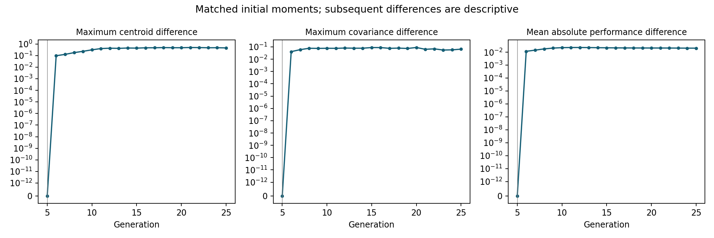

# Supporting information: population state and organized variation

**Jack Chen**

Frederick Sequencing and Genomics Core; Advanced Biomedical Computational Science (ABCS); Frederick National Lab for Cancer Research; National Institutes of Health.

Research preprint, version 1.1.0, 25 September 2026. Computational study; not externally peer reviewed.

## S1. Evidence map and dependence

| Study | Question | Evidence and dependence |
|---|---|---|
| V1-V3 | Inherited versus rotated orientation across transfer directions | Same 48 historical inputs across three transfer settings; not three training replications. All V1-V3 per-trial result tables are included. |
| 002 | Earlier state by later rule | Four continuations from crossed generation-5 checkpoints on the original cohort. |
| 003 | Centroid and complete centered configuration | Eight-cell intervention on the same checkpoints; changes covariance and higher empirical structure together. |
| 004 | Prospective choices using M, G and E summaries | New 48-history cohort. Choices frozen before continuations; the 0.02 usefulness target was not attained. |
| 005 | Local calibration versus horizon change | New evaluation streams from a fixed panel of 004 checkpoints; no independent training replication. |
| 064 | Configuration beyond initial mean and covariance | Original 002 checkpoints and continuation streams; 12,288 reshaped continuations against stored controls; no new training. |

V1-V3 use 24 histories in each training regime, seven fixed transfer directions plus a uniform-direction reference, and eight paired trials per history/family. The two intervention stages reuse these histories. Study 004 supplies a second training cohort with the same group sizes. Study 005 selects trial IDs 0 and 1 prospectively, retaining both early states: 1,536 checkpoints, 24 conditional evaluation replicates each, with four branches sharing inputs within each paired row. There are 18,432 paired replicate rows, each retaining four branches; a row is not one independent historical replicate.

## S2. Statistical conventions

The unit for the reported population-level intervals is a whole historical training replicate. Transfer directions, trials, early arms and successive studies within a cohort remain dependent. Study 004 averages directions, trials and early arms equally within each history for its primary contrast, separately in each regime. No cohort pooling is used.

V1-V3 use the original bootstrap order statistics at sorted positions 50 and 1950 of 2,000 resamples. Later history grids use linearly interpolated percentile endpoints at 0.025 and 0.975. For early studies whose rows were not stored separately, publication packaging replays the original archived Python random seed and sampling order, stores those exact index rows, and verifies that they reproduce the original intervals. This adds no population observations and selects no new resampling seed. Studies 004 and 005 use their already stored regime-specific bootstrap rows. Small floating-point differences caused by arithmetic summation order are reported by the verifier.

Study 005's conditional sign classification uses two marginal 97.5% bootstrap intervals at each checkpoint, with a nominal Bonferroni joint 95% convention for those two horizons. This is approximate coverage and gives no simultaneous guarantee over the checkpoint panel. Counts of resolved reversals or contradictions describe this procedure, not known underlying error probabilities. The publication verifier recomputes history-level statistical grids; the prior internal reconstruction covers the conditional estimates from raw retained outputs. The large raw checkpoint/continuation archive is not included here.

## S3. Sign conventions and exact quantities

The transfer and state-intervention figures display O-minus-R performance, so a positive value favors the inherited orientation. The conditional calibration experiment instead uses O-minus-R loss, equivalently R-minus-O performance; a positive value favors the rotated rule. The figures label their conventions explicitly.

For conditional prediction a and replicate contrast D, subtracting the estimated variance of the replicate mean from (a minus mean D) squared gives an unbiased estimate of squared error against the conditional mean under independent replicates and finite second moments. The finite estimate can be negative. The local-error, horizon-change and signed cross-term estimates satisfy an algebraic identity but are not disjoint causal contributions. No component is floored at zero and no negative estimate is discarded.

The Gaussian formula in the manuscript is exact for ideal normalized weighting of a specified mixture. The actual process samples sequentially without replacement from a finite random candidate pool, retaining parents. An expectation of unnormalized offspring weight is neither a survival probability nor long-horizon expected population performance. These quantities must remain separate even when the formula is evaluated without numerical error.

## S4. Unfavorable and unresolved results

The geometry-aware starting-state predictor loses to the original predictor at the fixed terminal endpoint. Its descriptive early-horizon success does not move that endpoint. The fresh-cohort E-minus-M gain remains below 0.02, Gaussian moments achieve most of it, and switching is a strong baseline. The hindsight headroom calculation is post hoc and cannot be used as an operating policy or a general bound for other policy classes.

The structured 75-degree state comparison has the same positive point estimate under two bootstrap seeds but one interval includes zero. It is reported as uncertain. This does not reverse the supported state-by-rule interaction. Subgroup harms, unresolved three-factor results and negative corrected estimates remain in the complete statistical grids. No subgroup or seed was added to make these results positive.

## S5. Reproduction and data boundary

Run `python scripts/reproduce_statistics.py` to recompute all 8,320 saved mean/interval records, including the 380 study-064 records, from public history/group aggregates and fixed bootstrap rows. Run `python scripts/rebuild_figures.py` to regenerate all nine figures (seven main figures, the transfer overview and the supporting diagnostic). Run `python scripts/verify_release.py` for file hashes, provenance, figure sources and local links. Install dependencies from `requirements.txt` first.

Archived model and analysis files are organized by study in `code/`; configuration and complete summary grids are in `results/`. These source files are supplied for inspection and may require omitted large input archives for execution. The package does not claim complete raw-trajectory reproduction. Scientific results are unchanged from the accepted studies. Publication preparation runs statistical reductions and plotting only.

The separate private-memory manuscript concerns inherited strategy transmission in a different binary model: [Zenodo record](https://doi.org/10.5281/zenodo.22907237). It is not independent replication of this two-dimensional transfer study. The companion memory-and-fresh-search preprint concerns an externally imposed shared-cache search policy, not variation-rule switching. Each paper discloses its own evidence scope.

## S6. The fixed row-space intervention and mathematical invariant

Let 1 be the 32-vector of ones. The 32-by-31 Helmert matrix U has orthonormal columns with U^T 1=0. For zero-based column j=0,...,30, entries in rows i<=j are 1/sqrt((j+1)(j+2)); row j+1 is -(j+1)/sqrt((j+1)(j+2)); later rows are zero. Let Q be orthogonal. The full row map T=11^T/32+UQU^T satisfies T1=1 and T^T T=I. Therefore mu_shape=mu and D_shape^T D_shape=D^T D for centered coordinates D=X-1mu. Full trait covariance, not only its trace or eigenvalues, is preserved.

For the fixed quadratic objective, mean normalized loss equals the normalized loss of the centroid plus tr(H C)/(t^T H t), where C is denominator-N covariance. Preserving the centroid and C preserves this initial mean loss mathematically. It does not preserve each individual's loss, higher empirical structure or subsequent selected-population performance. Gaussian sufficiency in an ideal distributional calculation is a different assertion.

For each of the 1,536 distinct history/family/trial keys, the seed is the integer represented by the first 16 hexadecimal digits of SHA-256 of the string `2026092564|state-shape064-row-orthogonal|history|family|task`. Regime, source state and later rule are omitted to pair them. Python random.Random(seed).gauss(0.,1.) supplies a 31-by-31 Gaussian matrix in row-major order. Two-pass modified Gram-Schmidt proceeds through columns in order, with math.fsum inner products and positive Euclidean norms. No pivoting, redraw, determinant conditioning or outcome selection is allowed. Under ideal Gaussian arithmetic this is the positive-diagonal QR convention for an invariant orthogonal sample; finite PRNG and floating arithmetic implement an approximation. It does not create independent Gaussian population members.

All 6,144 transformed source states are retained, including any singular covariance. No covariance inverse, eigenvalue truncation or clipping is used. The frozen checks require finite entries, Q^TQ and QQ^T errors at most 2e-12, and each centroid/covariance/normalized-loss discrepancy at most 1e-12. Initial scalar accounting uses the same loss definition as the controls. The largest stored initial centroid, covariance and normalized-loss discrepancies were 3.33e-16, 4.16e-17 and 5.55e-16, respectively.

## S7. Pairing, outcomes and focused verification for 064

The eight cells are native and reshaped versions of OO, OR, RO and RR, where the first letter is the generation-5 source and the second is the later homogeneous rule. J_t=(Y_t,OO-Y_t,OR)-(Y_t,RO-Y_t,RR), and DELTA=J_native-J_shape. Four per-cell native-minus-shaped gaps G give the equivalent identity DELTA=G_OO-G_OR-G_RO+G_RR. G_MEAN is their average. There are 20 fixed metrics in each of 16 regime/family groups, two regime ALL8 groups and one paired regime-difference group: 380 mean/interval records.

Eight trials are averaged within each history/family; ALL8 then averages the eight families equally. A single bootstrap array uses random.Random(2026092565), with 2,000 rows of 24 randrange(24) calls in row-major order. The same rows are shared across all families, cells and regimes. This array was fixed before new outcomes; it is not the earlier studies' per-group bootstrap sequence. Native endpoint bytes and means remain unchanged, but older interval endpoints are not required to be identical. The procedure yields pointwise exploratory intervals without simultaneous family coverage or an equivalence conclusion.

The new job ran once for 193 seconds with one CPU and 4 GiB requested. All 248 delivered files were verified locally and on HPC. The supervisor checker imports no producer code. It recomputed 380 estimates, every initial match, and the fixed history-0 block in both regimes: 128 paired rows, 64 sampler matrices, 512 paths, 10,240 updates and 655,360 candidate scores. All selected indices matched exactly; maximum coordinate and interval discrepancies were 4.44e-16. No scope expansion or new scientific run was required. The executed sampler matrix comparison reached 3.00e-15, below its fixed tolerance. Numerical tolerance is not a statistical confidence interval.

Figure S1. Initial matching and subsequent descriptive divergence across the retained panel. The first two panels show maximum coordinate-wise centroid and covariance differences; the third shows mean absolute native-minus-reshaped performance difference. The symmetric-log display separates initial arithmetic error from later differences. These summaries are descriptive and do not identify a unique dynamic mediator.

The compact 064 addition supplies pair endpoints, history/group aggregates, the frozen bootstrap array, all 380 estimates, diagnostics, exact source bytes, specification and audit receipts. Its 12,288 new trajectories, original 002 checkpoints and Q matrices remain in the full HPC archive and are excluded from this compact release. Full raw replay is therefore not claimed. The existing 7,940 estimate checks are reused after unchanged-input/checker identity verification, giving 8,320 checked statistical records across this release. The unified public statistics command recomputes all 8,320 records without population simulation.
